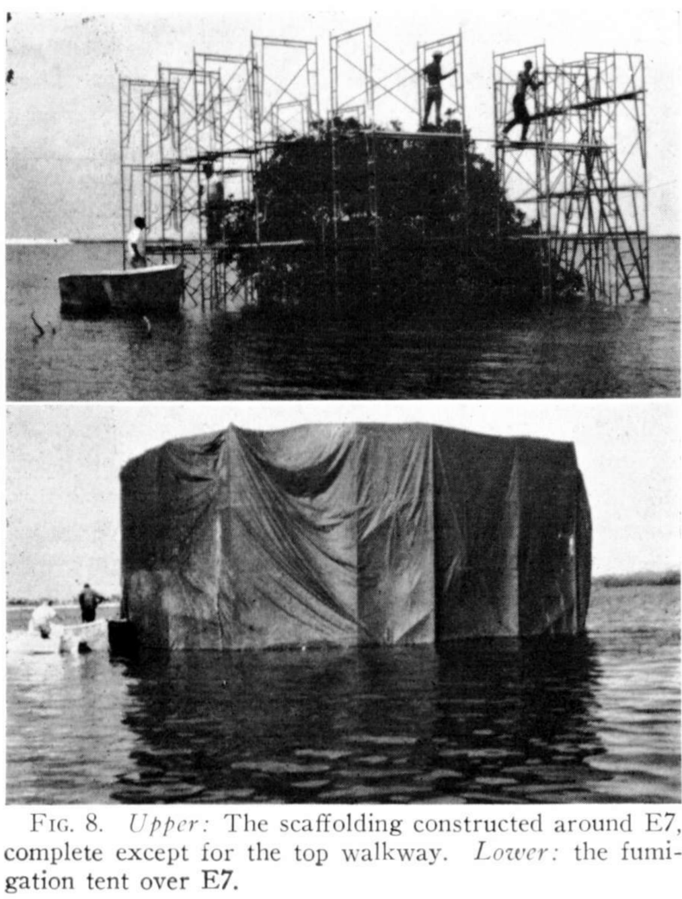

exclude: true

```{r setup, include=FALSE, echo=FALSE, message=FALSE, error=FALSE, include=FALSE, comment=FALSE}
options(htmltools.dir.version = FALSE)
xaringan::summon_remark()
library(tidyverse)
library(gt)

```

```{r xaringan-tile-view, echo=FALSE, message=FALSE, error=FALSE, include=FALSE, comment=FALSE}
xaringanExtra::use_tile_view()
xaringanExtra::use_webcam()
xaringanExtra::use_tachyons()
xaringanExtra::use_animate_css()
xaringanExtra::use_share_again()
#xaringanExtra::use_scribble(pen_color = "#56106E")
```

---
class: top left hide-count
background-image: url(img/giorgio-trovato-IclGoWB6wEY-unsplash.jpg)
background-size: cover

.move-top10[
.title-text[<span style='font-size:0.9em'>COVID-19 Genomic<br>Epidemiology</span>]  
.title-subtext[<span style='font-size:1.0em'>Promise, Problems & Open Questions</span>]  
]  
  
.callout-url-leftcorner[
.title-nametext[
Brendan J. Kelly, MD, MS  
Infectious Diseases, Epidemiology & Microbiology  
University of Pennsylvania  
`r format(Sys.Date(), '%d %B %Y')`   
]
]

.footnote-right[<span style='color: white'>photo: Giorgio Trovato @unsplash</span>]  


---

## Disclosures  

.pad-left[  

- No conflicts of interest.  

- Research supported by:

    - NIAID K23 AI121485  
    
    - CDC BAA 200-2021-10986   

]


---
class: full-screen hide-count

<div class="grid-3-1">
<div class="extension-tile gridset-a animated flipInY"><div>COVID-19<br>Genomic<br>Epidemiology</div></div>
</div>


---
layout: false
class: full-screen hide-count

<div class="grid-3-1">
<div class="extension-tile gridset-a"><div>COVID-19<br>Genomic<br>Epidemiology</div></div>
<div class="extension-tile gridset-b animated flipInX"><div>MDRO<br>Hotspots</div></div>
</div>


---
layout: false
class: full-screen hide-count

<div class="grid-3-1">
<div class="extension-tile gridset-a"><div>COVID-19<br>Genomic<br>Epidemiology</div></div>
<div class="extension-tile gridset-b"><div>MDRO<br>Hotspots</div></div>
<div class="extension-tile gridset-c animated bounceInDown"><div>Culture<br>vs<br>DNA</div></div>
</div>


---
layout: false
class: full-screen hide-count

<div class="grid-3-1">
<div class="extension-tile gridset-a"><div>COVID-19<br>Genomic<br>Epidemiology</div></div>
<div class="extension-tile gridset-grey"><div>MDRO<br>Hotspots</div></div>
<div class="extension-tile gridset-grey"><div>Culture<br>vs<br>DNA</div></div>
</div>


---

## The Problem: Antibiotic Resistance      
  
.pad-left[  
  
- CDC 2019 _Antibiotic Resistance Threats in the United States_:    
  
    - 2.8 million antibiotic-resistant infections in US per year  
    
    - 35,000 attributable deaths per year  
    
    - plus 223,900 _C. difficile_ hospitalizations & 12,800 deaths annually  
    
- "Stop relying only on new antibiotics that are slow getting to market and that, sadly, these germs will one day render ineffective. We need to adopt aggressive strategies that keep the germs away and infections from occurring in the first place."   
  
    - ceftazidime-avibactam approved 2015 → on-treatment resistance 2017  
    
    - meropenem-vaborbactam approved 2017 → on-treatment resistance 2020  
    
]  

.footnote-left[CDC AR Threats Report 2019; Shields et al _AAC_ 2017; Shields et al _CID_ 2020]  
  
  
---

## The Objective: "keep the germs away"    
  
.pad-left[  
  
- "Strategies that keep the germs away and infections from occurring":  

    - infection control + antibiotic stewardship: ~ 85% reduction   
  
    - **microbial therapeutics for colonization resistance**   
  
- Outline:   
    
    - ecology of bacterial infection (VAP & _C. difficile_ infection)    
    
    - microbiome change during & after antibiotics    
    
    - engineering post-antibiotic repopulation for MDRO colonization resistance        
  
]  


.footnote-left[Fridkin et al _MMWR_ 2014; Yokoe et al _ICHE_ 2015]  


---

## The Objective: "keep the germs away"    
  
.pad-left[  
  
- "Strategies that keep the germs away and infections from occurring":  

    - infection control + antibiotic stewardship: ~ 85% reduction   
  
    - **microbial therapeutics for colonization resistance**   
  
- Outline:   
    
    - ecology of bacterial infection (VAP & _C. difficile_ infection)    
    
    - microbiome change during & after antibiotics    
    
    - engineering post-antibiotic repopulation for MDRO colonization resistance        


.center[**~ highlight collaborations with other Penn Infectious Diseases faculty ~**]
  
]  


.footnote-left[Fridkin et al _MMWR_ 2014; Yokoe et al _ICHE_ 2015]  


---
class: top left hide-count
background-image: url(img/yudi-haryasa-HEpUyHwJuzQ-unsplash.jpeg)
background-size: cover

## <span style='color: #093b85;'>Introduction: Island Ecology</span>


.footnote-right[<span style='color: white'>photo: Yudi Haryasa @unsplash</span>]  


---
class: hide-count

.pull-left[
```{r, echo=FALSE, echo=FALSE, message=FALSE, warning=FALSE, error=FALSE, fig.align='center', out.width='55%'}
knitr::include_graphics(path = "img/tibg_title_authors.png")

```

```{r, echo=FALSE, echo=FALSE, message=FALSE, warning=FALSE, error=FALSE, fig.align='center', out.width='75%'}
knitr::include_graphics(path = "img/tibg_figure7_equilibrium_model.png")

```

]

.pull-right[

```{r, echo=FALSE, echo=FALSE, message=FALSE, warning=FALSE, error=FALSE, fig.align='center', out.width='80%'}
knitr::include_graphics(path = "img/wilson_simberloff_ecology_1969_fig3map.png")

```

```{r, echo=FALSE, echo=FALSE, message=FALSE, warning=FALSE, error=FALSE, fig.align='center', out.width='80%'}
knitr::include_graphics(path = "img/wilson_simberloff_ecology_1969_tab1.png")

```

]


.footnote-left[Macarthur & Wilson 1967; Simberloff & Wilson _Ecology_ 1969]


---
class: hide-count

.pull-left[

```{r, echo=FALSE, echo=FALSE, message=FALSE, warning=FALSE, error=FALSE, fig.align='center', out.width='90%'}
knitr::include_graphics(path = "img/wilson_simberloff_ecology_1969_fig2.png")
# 

```


]

.pull-right[
```{r, echo=FALSE, echo=FALSE, message=FALSE, warning=FALSE, error=FALSE, fig.align='center', out.width='90%'}
knitr::include_graphics(path = "img/wilson_simberloff_ecology_1969_fig8.png")
# 

```

]


.footnote-left[Wilson & Simberloff _Ecology_ 1969]


---
class: hide-count

.pull-left[

```{r, echo=FALSE, echo=FALSE, message=FALSE, warning=FALSE, error=FALSE, fig.align='center', out.width='90%'}
knitr::include_graphics(path = "img/wilson_simberloff_ecology_1969_fig8_crop.png")

```


]

.pull-right[
```{r, echo=FALSE, echo=FALSE, message=FALSE, warning=FALSE, error=FALSE, fig.align='center', out.width='60%'}
knitr::include_graphics(path = "img/simberloff_wilson_ecology_1969_fig1_fig2.png")

```

]


.footnote-left[Wilson & Simberloff _Ecology_ 1969; Simberloff & Wilson _Ecology_ 1969]


---
class: hide-count

.pull-left[
```{r, echo=FALSE, echo=FALSE, message=FALSE, warning=FALSE, error=FALSE, fig.align='center', out.width='90%'}
knitr::include_graphics(path = "img/wilson_simberloff_ecology_1969_fig8_crop.png")

```

]

.pull-right[
```{r, echo=FALSE, echo=FALSE, message=FALSE, warning=FALSE, error=FALSE, fig.align='center', out.width='85%'}
knitr::include_graphics(path = "img/icu_patient_and_doc_crop.png")

```

]

.footnote-left[Wilson & Simberloff _Ecology_ 1969; photo: _New York Times_]


---

## Repopulation & Infection Risk  
  
.pad-left[  

- Post-infection/antibiotic repopulation matters:      

    - both infection & antibiotics decimate mucosal microbial communities  
  
    - the "source" for repopulation is an MDRO-rich hospital environment  
    
    - failed repopulation risks recurrent infection (CDI & others)   
    
    - microbial therapeutics can restore colonization resistance  
  
    
]  

.footnote-left[Blaser _Science_ 2016; Raymond et al _ISME J_ 2016; Kelly & Tebas _Chest_ 2018; Al-Hasan et al _J Infect_ 2010; Jensen et al _CMI_ 2011; Munoz et al _CMI_ 2016]  


---
class: top left hide-count
background-image: url(img/cdc-aQOe0Ri267U-unsplash.jpg)
background-size: cover

.move-bottom20[
## <span style='color: #fce60e'>The Bacterial Ecology of Infection</span>  
]  


.footnote-right[<span style='color: white'>photo: CDC @unsplash</span>]  


---

## The Bacterial Ecology of Infection          
  
.pad-left[  
  
- What is the shape of the bacterial community during bacterial infection?    
  
    - ventilator-associated pneumonia (VAP)  
    
    - _C. difficile_ infection  
  
- What bacterial community features aid diagnosis of infection?    
  
  
]  


---

## Pilot Study: Bacterial Ecology of VAP          
  
.pad-left[  
  
- **Aim**: respiratory bacterial community change during critical illness & ventilation  

- **Population**: 15 adult subjects admitted to medical ICU  
    
- **Sampling**: upper & lower respiratory q48-72h for 16S rRNA gene sequencing  
    
- **Comparison**: healthy controls sampled via bronchoscopy  
    
- **Outcome**: change in community composition, ventilator-associated pneumonia (VAP)
  
]  

.footnote-left[Kelly et al _Microbiome_ 2016]  


---
background-image: url(figs/kelly_microbiome_2016_heatmap.png)
background-size: 65%


.footnote-left[Kelly et al _Microbiome_ 2016]  


---
background-image: url(figs/kelly_microbiome_2016_boxplot.png)
background-size: 65%


.footnote-left[Kelly et al _Microbiome_ 2016]  


---

## Validation Study: Bacterial Ecology of VAP          
  
.pad-left[  
  
- **Aim**: respiratory microbiome disruption indices (MDIs) to predict VAP  

- **Population**: 84 long-term acute care (LTACH) patients on mechanical ventilation    
    
- **Sampling**: upper & lower respiratory q24-48h (1066 specimens for 16S & qPCR)  
    
- **Comparison**: within-subject change over time    
    
- **Outcome**: VAP (with sensitivity analysis)  
  
]  

.footnote-left[Harrigan et al _CID_ 2021]  


---
background-image: url(figs/harrigan_cid_2021_oddsratio.png)
background-size: 65%


.footnote-left[Harrigan et al _CID_ 2021]  


---
background-image: url(figs/harrigan_cid_2021_outcomes.png)
background-size: contain


.footnote-left[Harrigan et al _CID_ 2021]  


---

## Bacterial Ecology of _C. difficile_ Infection            
  
.pad-left[  
  
- **Aim**: microbiome features that discriminate _C. difficile_ colonization / infection    

- **Population**: 384 consecutive positive _C. difficile_ tests (in- & outpatient)   
    
```{r, warning=FALSE, error=FALSE, echo=FALSE, message=FALSE}

read_csv("./tabs/cd_specimen_count.csv") %>%
  gt() %>%
  gt::cols_label(cdiff_category = html("<i>C. difficile</i><br>Category"), n = html("Subject<br>Count")) %>%
  gt::fmt_percent(columns = "Proportion", decimals = 1) %>%
    tab_options(column_labels.font.size = 16,
                column_labels.font.weight = "bold",
                table.font.size = 16) %>%
  identity() -> cd_tab
cd_tab


```
    
- **Sampling**: stool 16S rRNA gene sequencing & 16S rRNA gene qPCR  
    
- **Comparison**: toxin EIA+ (infection) versus NAAT+ only (colonization)     
    
- **Outcome**: EIA+, with fecal lactoferrin as sensitivity analysis    
  
]  

.footnote-left[Kevin Alby, Colin Tkatch, John Jachimiak. Submitted.]  


---
background-image: url(figs/p_cdi_cat_fecal_lacto_boxplot_tp.png)
background-size: 65%


.footnote-left[Kevin Alby, Colin Tkatch, John Jachimiak. Submitted.]  


---
background-image: url(figs/p_toxineia_clostridioides_boxplot_tp.png)
background-size: 65%


.footnote-left[Kevin Alby, Colin Tkatch, John Jachimiak. Submitted.]  


---
background-image: url(figs/p_free.png)
background-size: contain


.footnote-left[Kevin Alby, Colin Tkatch, John Jachimiak. Submitted.]  


---

## The Bacterial Ecology of Infection          
  
.pad-left[  
  
- Bacterial infection associated with dominance of single strain:  

    - ventilator-associated pneumonia (VAP)  
    
    - _C. difficile_ infection  
  
- Low diversity predicts the risk for respiratory infection.  
  
- **Dominance / low diversity → <u>repopulation</u>**
  
]  

.footnote-left[Dickson _Eur Resp J_ 2018; Sulaiman et al _Eur Resp J_ 2018]  


---
class: top left hide-count
background-image: url(img/cdc-y--8fqaK1kY-unsplash.jpeg)
background-size: cover

.pull-farright[
## <span style='color: #c7b8e3'>Antibiotics & Empty Islands</span>  
]

.footnote-right[<span style='color: black'>photo: CDC @unsplash</span>]  


---

## Antibiotics & Empty Islands          
  
.pad-left[  
  
- How do different antibiotics impact gut & respiratory bacterial communities?    
  
    - well defined spectrum of activity in vitro  
    
    - complex interactions in vivo  
  
- Implications of antibiotic selection & duration for repopulation?    

    - post-antibiotic <u>survivors</u>  
    
    - post-antibiotic <u>colonizers</u>  
  
]  


---

## Impact of Antibiotics During Induction Chemotherapy    

.pad-left[

- **Aim**: impact of antibiotics on gut microbiome during chemo/SCT admission      

- **Population**: 60 adults with acute myeloid leukemia (42%) or multiple myeloma (37%)    
    
- **Sampling**: stool specimens for 16S rRNA gene sequencing    
    
- **Comparison**: across antibiotic classes    
    
- **Outcome**: bacterial community diversity & membership    
  
]

.footnote-left[Ziegler et al _OFID_ 2019]  


---
background-image: url(figs/ziegler_ofid_2019_flow.png)
background-size: contain


.footnote-left[Ziegler et al _OFID_ 2019]  

---
background-image: url(figs/ziegler_ofid_2019_table.png)
background-size: contain


.footnote-left[Ziegler et al _OFID_ 2019]  


---
background-image: url(figs/ziegler_ofid_2019_pcoa.png)
background-size: contain


.footnote-left[Ziegler et al _OFID_ 2019]  

---

## Survivors: Pseudomonas Recurrence Risk    

.pad-left[

- **Aim**: define <u>post-antibiotic</u> factors a/w risk for recurrent _Pseudomonas_ VAP  

- **Population**: 29 long-term acute care (LTACH) patients with _Pseudomonas_ VAP     
    
- **Sampling**: lower respiratory metagenomic sequencing & culture for WGS   
    
- **Comparison**: subjects with and without recurrent _Pseudomonas_ infection      
    
- **Outcome**: recurrent _Pseudomonas_ VAP    
  
]


---
background-image: url(figs/r01_psa_persistence.png)
background-size: 65%


.footnote-left[Clarke et al. Submitted.]  


---
background-image: url(figs/p_psa_recur_crop.png)
background-size: 65%


.footnote-left[Clarke et al. Submitted.]  


---
background-image: url(figs/r01_psa_SNV.png)
background-size: 65%


.footnote-left[Clarke et al. Submitted.]  


---

## Colonizers: How Does the Hospital Microbiome Move?  
  
.pad-left[
  
- **Aim**: define patient-environment microbiome & MDRO exchange    

- **Population**: 102 hospital rooms with MDRO-associated patient admitted      
    
- **Sampling**: patient & near/far/bathroom swabs for culture & 16S     
    
- **Comparison**: patient vs environment           
    
- **Outcome**: shared ASVs, bacterial genera, MDROs; transmission events       
  
]

.footnote-left[Matt Ziegler. Unpublished.]  


---
background-image: url(figs/p_mod_0_4.png)
background-size: contain


.footnote-left[Matt Ziegler. Unpublished.]  


---
class: middle

.pull-left[

```{r, echo=FALSE, echo=FALSE, message=FALSE, warning=FALSE, error=FALSE, fig.align='center', out.width='150%'}
knitr::include_graphics(path = "figs/p_mod_0_3.png")

```

]

.pull-right[

```{r, echo=FALSE, echo=FALSE, message=FALSE, warning=FALSE, error=FALSE, fig.align='center', out.width='90%'}
knitr::include_graphics(path = "figs/p_ea_transfer.png")

```


```{r, warning=FALSE, error=FALSE, echo=FALSE, message=FALSE}

tibble(Contrast = c("+1 Week Antibiotics", "+1 Antibiotic-Day"),
       Estimate = c("8.47%", "0.40%"),
       `95% Credible Interval` = c("6.57% to 10.36%", "0.32% to	0.49%")) %>%
  gt() %>%
  tab_options(column_labels.font.size = 16,
              column_labels.font.weight = "bold",
              table.font.size = 16) %>%
  identity() -> abx_tab
abx_tab


```

]


.footnote-left[Matt Ziegler. Unpublished.]  


---

## Colonizers: What's in the Hospital Microbiome?              
  
.pad-left[
  
- **Aim**: define environmental multidrug-resistant organism (MDROs) contamination    

- **Population**: 51 hospital rooms with MDRO-associated patient admitted      
    
- **Sampling**: composite near, intermediate, far swabs for culture & 16S     
    
- **Comparison**: bacterial contamination & MDRO detection by distance         
    
- **Outcome**: culturable MDRO from the healthcare environment       
  
]

.footnote-left[Kelly et al _ICHE_ 2021]  


---
background-image: url(figs/kelly_iche_2021_cx.png)
background-size: contain


.footnote-left[Kelly et al _ICHE_ 2021]  


---
background-image: url(figs/kelly_iche_2021_gram.png)
background-size: contain


.footnote-left[Kelly et al _ICHE_ 2021]  


---
background-image: url(figs/kelly_iche_2021_asv.png)
background-size: contain


.footnote-left[Kelly et al _ICHE_ 2021]  


---

## Antibiotics & Empty Islands          
  
.pad-left[  
  
- Large effects of antibiotic selection on post-antibiotic gut community:    
  
    - differences betwen BSBL, levofloxacin, oral vancomycin  
  
- Post-antibiotic repopulation impacts MDRO risk:  

    - survivors: _Pseudomonas_ survivors post-VAP treatment  
    
    - colonizers: repopulation from **MDRO-rich environmental microbiome**  
  
]  


---
class: top left hide-count
background-image: url(img/PMT3_pop.jpeg)
background-size: cover

.move-bottom35-center[
## <span style='color: #ffe9d6'>Engineering Post-Antibiotic Repopulation</span>  
]

.footnote-right[<span style='color: black'>photo: Laura Cowden</span>]  


---

## Microbial Community Engineering  
  
.pad-left[

- How can we control bacterial community succession in the post-antibiotic period?  

- What is the effect of fecal microbiota transplant (FMT)?  

- Which bacteria contribute most to colonization resistance?  

]

.footnote-left[Seekatz et al _mBio_ 2014; Dedrick et al _Nature Med_ 2019]  


---

## Fecal Microbiota Transplant (FMT)  
  
.pad-left[

- **Aim**: define the utility of FMT for severe/complicated _C. difficile_ infection    

- **Population**: 15 subjects with severe/complicated CDI      
    
- **Intervention**: Penn Microbiome Therapy (PMT) -001, -002, -003 + SOC abx  
    
- **Control**: standard of care antibiotic treatment      
    
- **Outcome**: time to resolution of severe CDI symptoms    

]

.footnote-left[Lauren Dutcher. Unpublished.]  


---
background-image: url(figs/p_fmt_richness_tp.png)
background-size: 65%


.footnote-left[Lauren Dutcher. Unpublished.]  


---

## Contributors to Colonization Resistance    
  
```{r, echo=FALSE, echo=FALSE, message=FALSE, warning=FALSE, error=FALSE, fig.align='center', out.width='45%'}
knitr::include_graphics(path = "img/staph_psa_coculture.jpg")

```


.footnote-left[Sean Loughrey, Jessie Gunoskey, Michael David. Unpublished.]  


---
background-image: url(figs/p_S001_print.png)
background-size: 65%


.footnote-left[Sean Loughrey, Jessie Gunoskey, Michael David. Unpublished.]  


---

## FMT to Prevent Recurrent MDRO Infection    
  
.pad-left[

- **Aim**: define the utility of FMT for MDRO prevention    

- **Population**: 150 subjects finishing antibiotics for MDRO infections        
    
- **Intervention**: post-antibiotic Penn Microbiome Therapy (PMT) -001, -002   
    
- **Control**: standard of care post-antibiotic observation      
    
- **Outcome**: MDRO persistence      

]

.footnote-left[Anthony et al _JID_ 2020; Buelow et al _Microbiome_ 2017; Buffie et al _Nature Rev Micro_ 2013; Raymond et al _ISME J_ 2016; Millan et al _CID_ 2016; Gopalsamy et al _ICHE_ 2018; Saha et al _CMI_ 2019]  


---

## Microbial Community Engineering  
  
.pad-left[

- Post-antibiotic bacterial community succession can be altered by:

    - introduction of bacterial communities via FMT
    
    - (engraftment possible even during concomitant antibiotics) 

- To better engineer post-antibiotic bacterial communities:

    - mechanistic studies of inhibitory bacteria-bacteria interactions    
    
    - randomized trial of post-antibiotic FMT for MDRO clearance      

]


---
class: top left hide-count
background-image: url(img/christina-victoria-craft-WHSnkIwWpec-unsplash.jpeg)
background-size: cover

## <span style='color: #226252'>Conclusion: Into the 'LBP' Era</span>  


.footnote-right[<span style='color: white'>photo: Christina Victoria Craft @unsplash</span>]  


---

## Live Biotherapeutic Products (LBPs)    

.pull-left[

```{r, echo=FALSE, echo=FALSE, message=FALSE, warning=FALSE, error=FALSE, fig.align='center', out.width='45%'}
knitr::include_graphics(path = "img/ser_109_nejm.png")

```


]

.pull-right[
  
- first approval expected 2022:    

    - Rebiotix, Seres, Vedanta, Finch  
    
- applications:  

    - _C. difficile_  
    
    - IBD  
    
    - PD-1 potentiation  
    
    - MDRO colonization  
    
    - food allergy   

]

.footnote-left[Feuerstadt et al _NEJM_ 2022; Davar et al _Science_ 2021; Baruch et al _Science_ 2021]  

---

## Conclusions    
  
.pad-left[

- Bacterial infections like VAP, _C. difficile_ are characterized by low-diversity / dominance, emphasizing the importance of post-treatment repopulation.  

- Antibiotics exacerbate low-diversity state in a class-dependent manner.  

- Late reinfection may represent a failure of <u>post-antibiotic repopulation</u>. Passive repopulation from the healthcare environment risks MDRO colonization.    
  
- FMT and LBPs are methods by which we can exert control over post-antibiotic repopulation and prevent infection.        
  
]


---

## Acknowledgements    

.pull-left[
- __ARES Group @ Penn__
Laurel Glaser, Kyle Rodino, Sean Loughrey, Laura Cowden,   
Magda Wernovsky, Jessie Gunoskey, Jennifer Han, Erik Clarke, Michael David,
Matt Ziegler, Lauren Dutcher, Ebbing Lautenbach, Jim Harrigan  

- __Bushman Laboratory @ Penn__
Arwa Abbas, Aoife Roche, Andrew Marques,
Aubrey Bailey, John Everett,
Rick Bushman

- __PennCHOP Microbiome Program__
Lisa Mattei, Casey Hofstaedter, Huanjia Zhang, Kyle Bittinger

]


.pull-right[
- __Collman Laboratory @ Penn__
Ize Imai, Aurea Simon Soro, John McGinniss, Ron Collman

- __Division of ID @ Penn__
Ian Frank, Pablo Tebas, Robert Gross, Emily Blumberg

- __Rutgers University & Penn DBEI__
Jason Roy, Arman Oganisian
  
- __CDC Prevention Epicenters__
Clifford McDonald, Alison Laufer Halpin
  
- __Funding__
<u>CDC</u>: BAAs 200-2016-91964, 200-2018-02919, 200-2021-10986,
200-2021-10986 & <u>NIAID</u>: K23 AI121485

]

.center[
### brendank@pennmedicine.upenn.edu
]


---
class: middle center hide-count
background-image: url(img/giorgio-trovato-IclGoWB6wEY-unsplash.jpg)
background-size: cover

.title-subtext[Questions?]


---
exclude: true
class: middle center hide-count
background-image: url(img/giorgio-trovato-IclGoWB6wEY-unsplash.jpg)
background-size: cover

.title-subtext[Questions?]

.callout-url-bottom[  
.fade-in[<span style="font-size:0.5em; color:white">slides ↓ </span>]  
<span style="link-color:white">[bjklab.org](http://www.bjklab.org)</span>  
]  


