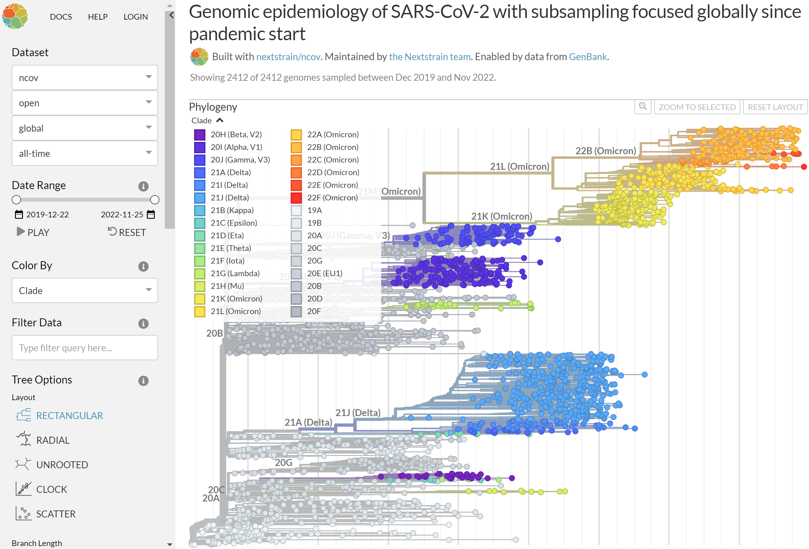

exclude: true

```{r setup, include=FALSE, echo=FALSE, message=FALSE, error=FALSE, include=FALSE, comment=FALSE}
options(htmltools.dir.version = FALSE)
xaringan::summon_remark()
library(tidyverse)
library(gt)

```

```{r xaringan-tile-view, echo=FALSE, message=FALSE, error=FALSE, include=FALSE, comment=FALSE}
xaringanExtra::use_tile_view()
xaringanExtra::use_webcam()
xaringanExtra::use_tachyons()
xaringanExtra::use_animate_css()
xaringanExtra::use_share_again()
#xaringanExtra::use_scribble(pen_color = "#56106E")
```

---
class: top left hide-count
background-image: url(img/giorgio-trovato-IclGoWB6wEY-unsplash.jpg)
background-size: cover

.move-top20[
.title-text[<span style='font-size:1.0em'>COVID-19</span>]  
.title-subtext[<span style='font-size:1.0em'>The Promise & Problems of Genomic Epidemiology</span>]  
]  
  
.callout-url-leftcorner[
.title-nametext[
Brendan J. Kelly, MD, MS  
Infectious Diseases, Epidemiology & Microbiology  
University of Pennsylvania  
`r format(Sys.Date(), '%d %B %Y')`   
]
]

.footnote-right[<span style='color: white'>photo: Giorgio Trovato @unsplash</span>]  


---

## Disclosures  

.pad-left[  

- No conflicts of interest.  

- Research supported by:

    - NIAID K23 AI121485  
    
    - CDC BAA 200-2021-10986   

]


---
class: full-screen hide-count

<div class="grid-3-1">
<div class="extension-tile gridset-a animated flipInY"><div>COVID-19<br>Genomic<br>Epidemiology</div></div>
</div>


---
layout: false
class: full-screen hide-count

<div class="grid-3-1">
<div class="extension-tile gridset-a"><div>COVID-19<br>Genomic<br>Epidemiology</div></div>
<div class="extension-tile gridset-b animated flipInX"><div>Biases &<br>Limitations</div></div>
</div>


---
layout: false
class: full-screen hide-count

<div class="grid-3-1">
<div class="extension-tile gridset-a"><div>COVID-19<br>Genomic<br>Epidemiology</div></div>
<div class="extension-tile gridset-b"><div>Biases &<br>Limitations</div></div>
<div class="extension-tile gridset-c animated bounceInDown"><div>Omicron<br>Origins</div></div>
</div>


---
layout: false
class: full-screen hide-count

<div class="grid-3-1">
<div class="extension-tile gridset-a"><div>COVID-19<br>Genomic<br>Epidemiology</div></div>
<div class="extension-tile gridset-grey"><div>Biases &<br>Limitations</div></div>
<div class="extension-tile gridset-grey"><div>Omicron<br>Origins</div></div>
</div>


---

## Genomic Epidemiology        
  
.pad-left[  
  
- __Epidemiology__:    
  
    - study of the distribution and determinants of health-related outcomes in a specified population  
    
    - the application of this study to improve health  
    
- __Genomic Epidemiology__:     
  
    -  use of pathogen genomic data to determine the distribution and spread of an infectious disease in a specified population  
    
    - the application of this information to improve health
  
]  

.footnote-left[[CDC COVID-19 Genomic Epidemiology Toolkit 1.1](https://www.cdc.gov/amd/pdf/slidesets/toolkitmodule_1.1-508c.pdf)]  
  
  
  
---

## SARS-CoV-2 Genomic Epidemiology        
  
.pad-left[  
  
- __SARS-CoV-2 Genomes__:    
  
    - SARS-CoV-2 genome: ~ 30,000 nucleotides (~ 10,000 amino acids)  
    
    - infer relatedness from phylogenetic distance    
    
- __RNA Genome Sequencing__:     
  
    - extract RNA, reverse transcription, multiplex PCR, end repair & ligation indexing  
    
    - short-read or long-read sequencing  
  
]  

.footnote-left[[CDC COVID-19 Genomic Epidemiology Toolkit 1.1](https://www.cdc.gov/amd/pdf/slidesets/toolkitmodule_1.1-508c.pdf)]  
  
  
  
---
  
## National & Local Applications    
  
.pad-left[  
  
- **National**:  

    - monitor emergence and movement of new strains   
  
    - monitor trends after intervention (e.g., vaccination)   
  
- **Local**:   
    
    - investigate clusters for transmission (workplace, healthcare, etc)    
    
    - reveal unexpected clusters    
    
]  


.footnote-left[[CDC COVID-19 Genomic Epidemiology Toolkit 1.1](https://www.cdc.gov/amd/pdf/slidesets/toolkitmodule_1.1-508c.pdf); [Washington Post](https://www.washingtonpost.com/graphics/2020/health/coronavirus-genetic-code/)]  

  
  
---
exclude: false

## International Collaboration      
  
.center[
```{r gisaid_website, echo=FALSE, message=FALSE, error=FALSE, comment=FALSE, eval=TRUE, autodep=TRUE, fig.align='center', out.width='95%'}
knitr::include_url("https://gisaid.org/")
```
]

  
.footnote-left[https://gisaid.org/]  

  
---
exclude: false

## International Collaboration      
  
.center[
```{r nextrain_website, echo=FALSE, message=FALSE, error=FALSE, comment=FALSE, eval=TRUE, autodep=TRUE, fig.align='center', out.width='70%'}

```
]

  
.footnote-left[https://nextstrain.org/ncov/open/global/all-time]  

  

---

## Variants of Concern  

.center[
```{r cdc_website, echo=FALSE, message=FALSE, error=FALSE, comment=FALSE, eval=TRUE, autodep=TRUE, fig.align='center', out.width='95%'}
knitr::include_url("https://www.cdc.gov/coronavirus/2019-ncov/variants/variant-classifications.html")
```
]

  
.footnote-left[https://www.cdc.gov/coronavirus/2019-ncov/variants/variant-classifications.html]  

  

---
exclude: false

## Local Tracking        
  
.center[
```{r penn_website, echo=FALSE, message=FALSE, error=FALSE, comment=FALSE, eval=TRUE, autodep=TRUE, fig.align='center', out.width='95%'}
knitr::include_url("https://microb120.med.upenn.edu/data/SARS-CoV-2")
```
]

  
.footnote-left[https://microb120.med.upenn.edu/data/SARS-CoV-2]  

  

---
exclude: true
class: hide-count

.pull-left[
```{r, echo=FALSE, echo=FALSE, message=FALSE, warning=FALSE, error=FALSE, fig.align='center', out.width='90%'}
knitr::include_graphics(path = "img/wilson_simberloff_ecology_1969_fig8_crop.png")

```

]

.pull-right[
```{r, echo=FALSE, echo=FALSE, message=FALSE, warning=FALSE, error=FALSE, fig.align='center', out.width='85%'}
knitr::include_graphics(path = "img/icu_patient_and_doc_crop.png")

```

]

.footnote-left[Wilson & Simberloff _Ecology_ 1969; photo: _New York Times_]


---
layout: false
class: full-screen hide-count

<div class="grid-3-1">
<div class="extension-tile gridset-grey"><div>COVID-19<br>Genomic<br>Epidemiology</div></div>
<div class="extension-tile gridset-b"><div>Biases &<br>Limitations</div></div>
<div class="extension-tile gridset-grey"><div>Omicron<br>Origins</div></div>
</div>


---
layout: false
class: full-screen hide-count

<div class="grid-3-1">
<div class="extension-tile gridset-grey"><div>COVID-19<br>Genomic<br>Epidemiology</div></div>
<div class="extension-tile gridset-grey"><div>Biases &<br>Limitations</div></div>
<div class="extension-tile gridset-c"><div>Omicron<br>Origins</div></div>
</div>


---
exclude: true

## Acknowledgements    

.pull-left[
- __ARES Group @ Penn__
Laurel Glaser, Kyle Rodino, Sean Loughrey, Laura Cowden,   
Magda Wernovsky, Jessie Gunoskey, Jennifer Han, Erik Clarke, Michael David,
Matt Ziegler, Lauren Dutcher, Ebbing Lautenbach, Jim Harrigan  

- __Bushman Laboratory @ Penn__
Arwa Abbas, Aoife Roche, Andrew Marques,
Aubrey Bailey, John Everett,
Rick Bushman

- __PennCHOP Microbiome Program__
Lisa Mattei, Casey Hofstaedter, Huanjia Zhang, Kyle Bittinger

]


.pull-right[
- __Collman Laboratory @ Penn__
Ize Imai, Aurea Simon Soro, John McGinniss, Ron Collman

- __Division of ID @ Penn__
Ian Frank, Pablo Tebas, Robert Gross, Emily Blumberg

- __Rutgers University & Penn DBEI__
Jason Roy, Arman Oganisian
  
- __CDC Prevention Epicenters__
Clifford McDonald, Alison Laufer Halpin
  
- __Funding__
<u>CDC</u>: BAAs 200-2016-91964, 200-2018-02919, 200-2021-10986,
200-2021-10986 & <u>NIAID</u>: K23 AI121485

]

.center[
### brendank@pennmedicine.upenn.edu
]


---
class: full-screen hide-count

<div class="grid-3-1">
<div class="extension-tile gridset-a animated flipInY"><div>COVID-19<br>Genomic<br>Epidemiology</div></div>
<div class="extension-tile gridset-b animated flipInX"><div>Biases &<br>Limitations</div></div>
<div class="extension-tile gridset-c animated bounceInDown"><div>Omicron<br>Origins</div></div>
</div>


---
class: middle center hide-count
background-image: url(img/giorgio-trovato-IclGoWB6wEY-unsplash.jpg)
background-size: cover

.title-subtext[Questions?]


---
exclude: true
class: middle center hide-count
background-image: url(img/giorgio-trovato-IclGoWB6wEY-unsplash.jpg)
background-size: cover

.title-subtext[Questions?]

.callout-url-bottom[  
.fade-in[<span style="font-size:0.5em; color:white">slides ↓ </span>]  
<span style="link-color:white">[bjklab.org](http://www.bjklab.org)</span>  
]  


